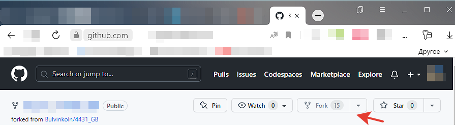
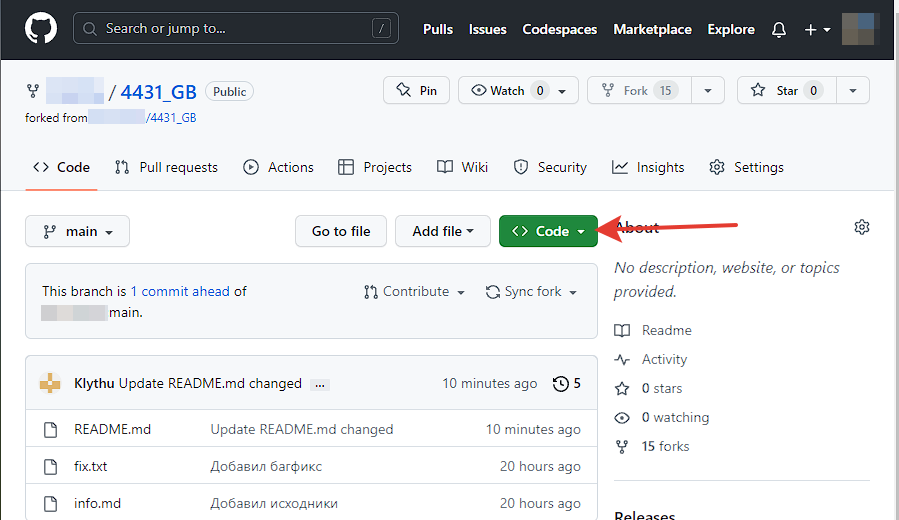
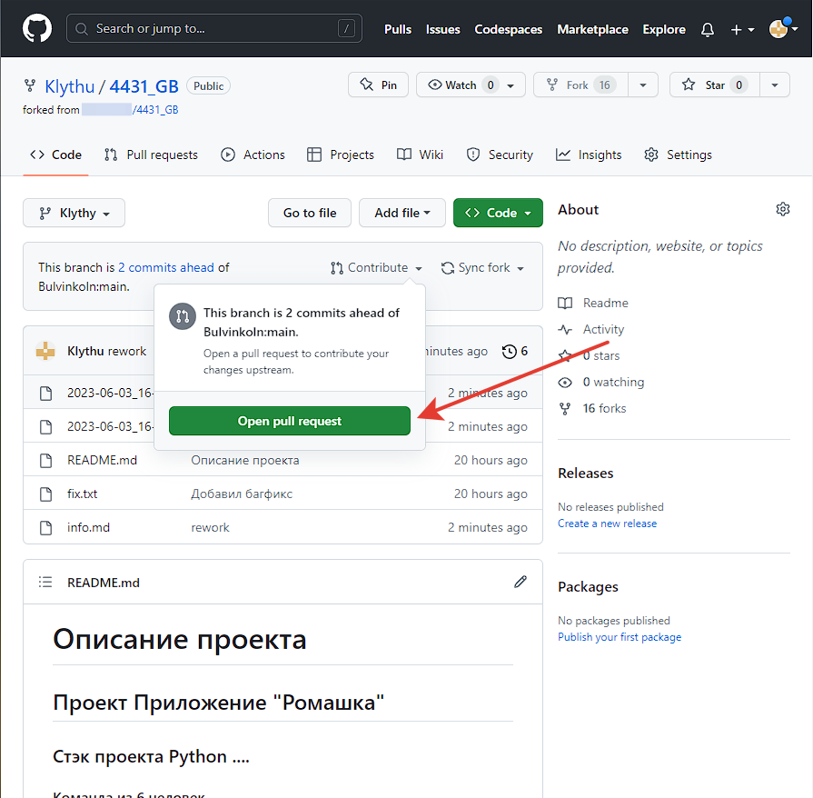

# git

## Comands for files
*git config* - settings

*git init* - use in folder to creat reposit

*git add filename/all/*. - start version control of a file / *all* files / all files

*git commit -a (-m "****")*- save changed file (add description of changes you have done) **-am for short**

*git log (--oneline)*- viwe what youve done in commyts (short viwe)/--graph - show commits from all brunches

*git diff* - look at changes sinse the last iteration

*git status *- remind your self about what is published

*git checkout *- hop between versions (id in log) or branches

_git help_ - your best friend

_git reset --hard versionid_ -backups version to the state of version id you can get it in the list after using _git log_

_git rebase -i_ - lrt you manipulate commis

## Comands for brances

_git branch_- show branches * -current bruach

_git branch **name**_ - create a branch name

_git branch -d **name**_ - delete branch name

_git merge **name**_ - add information fron branch name to current branch

## Comands for GitHub

_git clone_ - copy rep from GitHub

_git pull_ - get actual rep and merge with yours

_git push_ - add changes to online rep

## pull request

1. fork progect

2. _clone_ rep from your acc

2. create new brunch
3. add changes 
4. save and commit changes
5. pull it to your acc 
6. make request on github.com 

# information
https://habr.com/ru/articles/541258/

https://habr.com/ru/articles/542616/

https://www.atlassian.com/ru/git/tutorials/setting-up-a-repository

https://www.atlassian.com/ru/git/tutorials/saving-changes

https://www.atlassian.com/ru/git/tutorials/undoing-changes

etd  